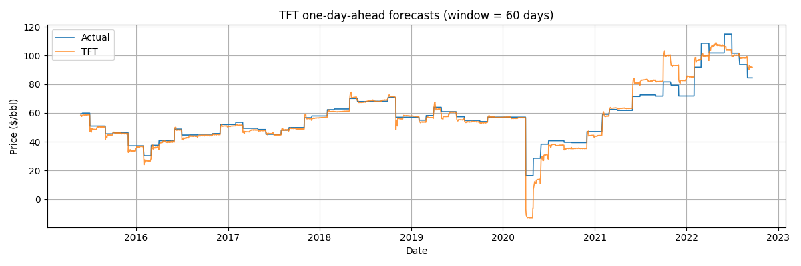
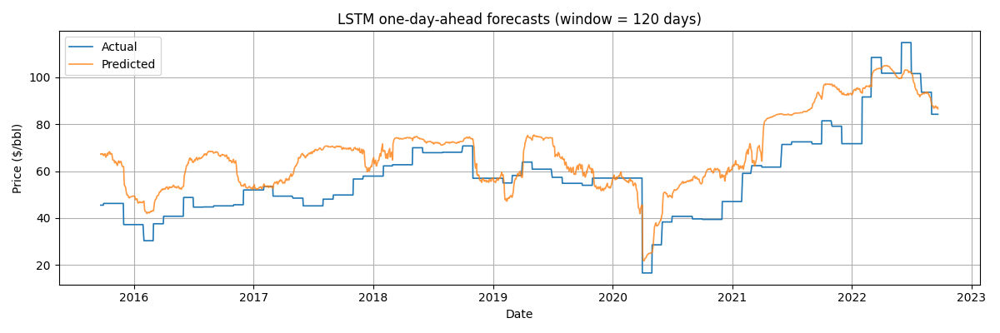

# Oil Price Forecasting with LSTM and TFT

This project predicts crude oil prices using two deep learning models: LSTM (Long Short-Term Memory) and TFT (Temporal Fusion Transformer). The models are trained on a rich dataset combining financial, macroeconomic, and sentiment features.

---

## Project Structure

```
.
├── check_dataset.py
├── download_gdelt.py
├── lstm_best.pt
├── lstm_sliding_predictions.png
├── merge_data.py
├── README.md
├── tft_sliding_predictions.png
├── data/
│   ├── processed/
│   └── raw/
├── eval_out/
├── lightning_logs/
├── logs/
├── lstm/
│   ├── dataset.py
│   ├── eval.py
│   ├── model.py
│   ├── train.py
│   └── utils.py
└── tft/
    ├── eval.py
    ├── test.py
    ├── tft_oil_price_forecast.ckpt
    └── train.py
```

---

## Data

- **Raw data**: Located in `data/raw/`, includes historical crude oil prices, macroeconomic indicators, and sentiment scores.
- **Processed data**: Located in `data/processed/`, includes merged and feature-engineered datasets ready for modeling.

---

## Dataset Description

The dataset used for this project is a comprehensive, time-indexed table that combines financial, macroeconomic, and sentiment features relevant to crude oil price forecasting. Each row represents a single trading day.

**Sample columns:**

```
Date, Open_x, High_x, Low_x, Close, Volume, Day, Weekday, Week, Month, Year, Tone, Positive_Score, Negative_Score, Polarity, Activity_Ref_Density, Self_Group_Density, value, Price, Open_y, High_y, Low_y, Change %, Crude Oil Production, Dry Natural Gas Production, Coal Production, Total Energy Production (qBtu), Liquid Fuels Consumption, Natural Gas Consumption, Coal Consumption, Electricity Consumption, Renewables Consumption, Total Energy Consumption (qBtu), Crude Oil ($/barrel), Natural Gas ($/mBtu), Coal ($/mBtu), Real Gross Domestic Product (Trillions), RGDP Percent change YOY (%), GDP Implicit Price Deflator, GDP IPD Percent change YOY (%), Real Disposable Personal Income, RDPI Percent change YOY (%), Manufacturing Production Index, MPI Percent change YOY (%), days_since_last_trade, ret_1d, ret_5d, ret_20d, vol_30d, series, time_idx, month, weekday
```

**Example row:**

```
2015-03-02,176.56,177.63,176.51,177.57,87491400.0,2.0,0.0,10.0,3.0,2015.0,-1.37,2.47,3.84,6.31,22.67,0.79,0.0,95.46,95.38,95.51,95.06,0.15,9.58,74.14,81.0,6.1,19.35,83.59,64.0,10.21,0.58,8.17,47.82,2.83,2.26,18.67,4.0,96.7,0.9,13811.0,4.5,100.3,0.0,1.0,0.0,0.0,0.0,0.0,global_oil,0,March,Monday
```

### Key Features

- **Financial:** SP500: Open, High, Low, Close, Volume, Price, Change %, returns, volatility.
- **Temporal:** Date, Day, Weekday, Week, Month, Year, days_since_last_trade, time_idx.
- **Sentiment:** Tone, Positive_Score, Negative_Score, Polarity, Activity_Ref_Density, Self_Group_Density.(gatheret from gdelt project)
- **Macroeconomic:** Crude Oil Production, Natural Gas Production, Coal Production, Energy Consumption, GDP, Manufacturing Index, etc.
- **Energy Prices:** Crude Oil ($/barrel), Natural Gas ($/mBtu), Coal ($/mBtu).
- **Categorical:** series, month, weekday.

This rich feature set enables the models to learn from a wide range of signals, including market activity, macroeconomic trends, and news sentiment.

**The processed dataset is located at:**  
`data/processed/filtered_merged_dataset_trimmed.csv`

---

## Models

### 1. LSTM

- Implemented in [`lstm/train.py`](lstm/train.py).
- Uses a sliding window approach with 120 days of historical data to predict the next day's price.
- Early stopping and best model checkpointing are used.
- Final predictions and evaluation plots are saved as `lstm_sliding_predictions.png`.

### 2. TFT (Temporal Fusion Transformer)

- Implemented in [`tft/train.py`](tft/train.py).
- Uses a 120-day encoder window for 1-day-ahead forecasts.
- Includes advanced features like attention, static and time-varying covariates, and group normalization.
- Final predictions and evaluation plots are saved as `tft_sliding_predictions.png`.

---

## Results

### TFT One-Day-Ahead Forecasts



*Figure: TFT one-day-ahead forecasts (window = 60 days). The blue line is the actual price, and the orange line is the TFT prediction.*

---

### LSTM One-Day-Ahead Forecasts



*Figure: LSTM one-day-ahead forecasts (window = 120 days). The blue line is the actual price, and the orange line is the LSTM prediction.*

---

## How to Run

1. **Prepare Data**
   - Place raw data in `data/raw/`.
   - Use `merge_data.py` to generate processed datasets.

2. **Train LSTM**
   ```sh
   python lstm/train.py
   ```
   - Model weights saved as `lstm_best.pt`.
   - Prediction plot saved as `lstm_sliding_predictions.png`.

3. **Train TFT**
   ```sh
   python tft/train.py
   ```
   - Checkpoints and logs saved in `lightning_logs/`.
   - Prediction plot saved as `tft_sliding_predictions.png`.

4. **Evaluate**
   - Use `tft/eval.py` and `lstm/eval.py` for detailed evaluation and additional plots.

---


## License

MIT License

---

*For questions or contributions, please open an issue or pull request.*